

  <!-- Hero Banner SVG -->
  

    

  <!-- Dynamic Typing Header SVG -->
  

    

  <!-- Quick Social Navigation Badges -->
  
  &nbsp;&nbsp;
  
  &nbsp;&nbsp;
  
  &nbsp;&nbsp;
  

 

 

<!-- ========================================== -->
<!-- 01. ABOUT ME & WHOAMI.DART -->
<!-- ========================================== -->

  

 

<table>
  <tr>
    <td width="60%" valign="top">
      <h3>🚀 Flutter Developer &amp; Mobile App Engineer</h3>
      

        Welcome! I am <strong>Mann Dangrechiya</strong>, a passionate Flutter Developer based in 
        <strong>Ahmedabad, Gujarat, India 🇮🇳</strong>.
      

      

        Currently working as a <strong>Flutter Developer at PrintDeed</strong> (Gandhinagar, Gujarat), building production-grade cross-platform applications for iOS &amp; Android. I hold a Bachelor's degree in <strong>Computer Engineering</strong> from LDRP Institute of Technology and Research (CGPA 7.76/10).
      

      

        Skilled in designing responsive UI, managing complex application state (<em>Riverpod</em>, <em>Provider</em>, <em>GetX</em>), integrating Firebase services &amp; REST APIs, and creating interactive 2D/3D graphics with Flame Engine and Rive 3D.
      

       
      <h4>🎯 Current Career Goal</h4>
      

        <strong>Become one of the best Flutter Engineers and Open Source contributors</strong> — crafting high-performance, 60 FPS mobile experiences while driving open-source community innovation.
      

    </td>
    <td width="40%" valign="top" align="center">
      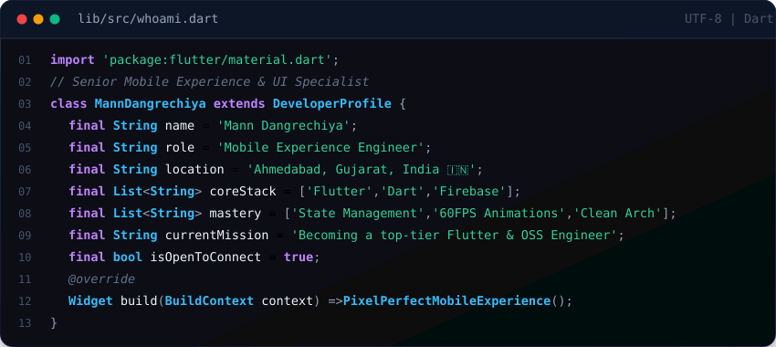
    </td>
  </tr>
</table>

 

 

<!-- ========================================== -->
<!-- 02. SPECIALIZATIONS & TECH STACK -->
<!-- ========================================== -->

  

 

  <table>
    <tr>
      <td align="center" width="16%">
        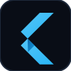 
        <strong>Flutter</strong> 
        Cross-Platform (95%)
      </td>
      <td align="center" width="16%">
        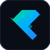 
        <strong>Dart</strong> 
        Async &amp; OOP (95%)
      </td>
      <td align="center" width="16%">
         
        <strong>Riverpod / Provider / GetX</strong> 
        State Flow (92%)
      </td>
      <td align="center" width="16%">
         
        <strong>Firebase Services</strong> 
        Auth &amp; Cloud (90%)
      </td>
      <td align="center" width="16%">
        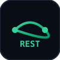 
        <strong>Firestore &amp; REST APIs</strong> 
        Realtime Sync (88%)
      </td>
      <td align="center" width="16%">
         
        <strong>Flame Engine &amp; Rive 3D</strong> 
        Games &amp; Shaders (88%)
      </td>
    </tr>
    <tr>
      <td align="center" width="16%">
         
        <strong>Android Native</strong> 
        Gradle &amp; Kotlin
      </td>
      <td align="center" width="16%">
         
        <strong>iOS Native</strong> 
        Swift &amp; Xcode
      </td>
      <td align="center" width="16%">
         
        <strong>Git &amp; GitHub</strong> 
        Version Control (90%)
      </td>
      <td align="center" width="16%">
        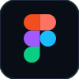 
        <strong>Figma to Code</strong> 
        UI/UX Design
      </td>
      <td align="center" width="16%">
         
        <strong>Firebase Hosting</strong> 
        Web Deployment
      </td>
      <td align="center" width="16%">
         
        <strong>IDE &amp; DevTools</strong> 
        App Profiling (90%)
      </td>
    </tr>
  </table>

 

 

<!-- ========================================== -->
<!-- 03. MOBILE ARCHITECTURE & SYSTEM DESIGN -->
<!-- ========================================== -->

  
  
    
  
  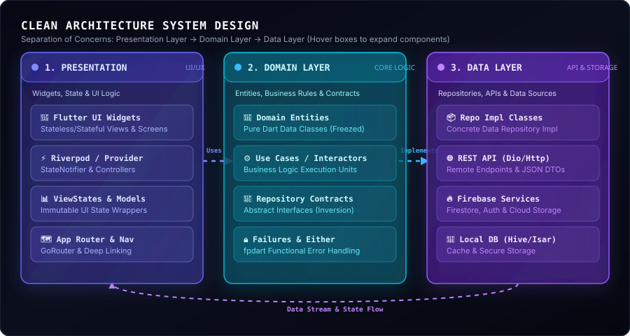

 

 

<!-- ========================================== -->
<!-- 04. FEATURED PROJECTS -->
<!-- ========================================== -->

  

    

  <!-- Interactive Device Mockup Carousel SVG -->
  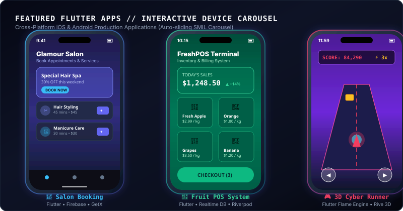

 

<table>
  <tr>
    <td width="50%" valign="top">
      <h3>💇 Salon Booking App</h3>
      

        Mobile application for booking salon services with real-time slot availability. Implemented user authentication, appointment scheduling, and booking management using Firebase with responsive UI navigation.
      

      

        <code>Flutter</code> • <code>Firebase</code> • <code>REST APIs</code> • <code>GetX</code>
      

      

        <a href="https://github.com/MannDangrechiya"><strong>View Project on GitHub &rarr;</strong></a>
      

    </td>
    <td width="50%" valign="top">
      <h3>🍎 Fruit POS System</h3>
      

        Point of Sale (POS) application for fruit vendors to manage sales, billing, and inventory efficiently. Integrated Firebase real-time data storage, transaction logs, and order summary generation.
      

      

        <code>Flutter</code> • <code>Firebase</code> • <code>State Management</code>
      

      

        <a href="https://github.com/MannDangrechiya"><strong>View Project on GitHub &rarr;</strong></a>
      

    </td>
  </tr>
  <tr>
    <td width="50%" valign="top">
      <h3>🧮 Universal Calculator</h3>
      

        Multi-functional calculator application featuring basic arithmetic, scientific operations, real-time result calculations, and responsive dark mobile UI styling.
      

      

        <code>Flutter</code> • <code>Dart</code> • <code>Mobile UI</code>
      

      

        <a href="https://github.com/MannDangrechiya"><strong>View Project on GitHub &rarr;</strong></a>
      

    </td>
    <td width="50%" valign="top">
      <h3>🎮 3D Cyber Runner (Flutter Flame)</h3>
      

        Cross-platform 3D endless runner game built in Flutter with Flame Engine, Rive 3D animations, custom GLSL shaders, collision physics, and real-time high-score leaderboards on Firebase.
      

      

        <code>Flutter</code> • <code>Flame Engine</code> • <code>Rive 3D</code> • <code>GLSL Shaders</code>
      

      

        <a href="https://github.com/MannDangrechiya"><strong>View Project on GitHub &rarr;</strong></a>
      

    </td>
  </tr>
</table>

 

 

<!-- ========================================== -->
<!-- 05. EXPERIENCE & TIMELINE -->
<!-- ========================================== -->

  

 

<table>
  <tr>
    <td width="50%" valign="top">
      <h4>💼 Flutter Developer</h4>
      
<strong>PrintDeed</strong> · Gandhinagar, Gujarat

      
<em>Jul 2026 – Present</em>

      <ul>
        <li>Developing and maintaining production cross-platform mobile applications in Flutter.</li>
        <li>Converting Figma UI/UX designs into responsive 60 FPS widget structures.</li>
        <li>Integrating REST APIs, managing backend service communication, and debugging performance bottlenecks.</li>
      </ul>
    </td>
    <td width="50%" valign="top">
      <h4>💼 Flutter Developer Intern</h4>
      
<strong>TechyPanther</strong> · Ahmedabad, Gujarat

      
<em>Sep 2025 – Feb 2026</em>

      <ul>
        <li>Developed cross-platform mobile apps using Flutter and Dart with responsive UI architecture.</li>
        <li>Implemented state management (Provider / GetX) for efficient data flow and clean separation.</li>
        <li>Integrated Firebase Authentication, Firestore, and Storage services.</li>
      </ul>
    </td>
  </tr>
</table>

 

  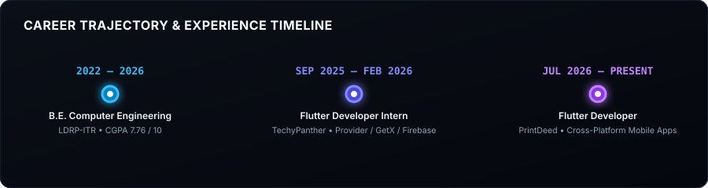

 

 

<!-- ========================================== -->
<!-- 06. EDUCATION & CERTIFICATIONS -->
<!-- ========================================== -->

  

 

<table>
  <tr>
    <td width="50%" valign="top">
      <h3>🎓 Education</h3>
      
<strong>B.E. in Computer Engineering</strong>

      
LDRP Institute of Technology and Research, KSV University

      
<em>Gandhinagar, Gujarat (2022 – 2026)</em>

      
<strong>CGPA:</strong> 7.76 / 10

    </td>
    <td width="50%" valign="top">
      <h3>📜 Certifications</h3>
      <ul>
        <li><strong>Flutter &amp; Dart Development</strong> — <em>Udemy</em></li>
        <li><strong>Python for Data Science</strong> — <em>NPTEL</em></li>
        <li><strong>Enhancing Soft Skills &amp; Personality</strong> — <em>NPTEL</em></li>
      </ul>
    </td>
  </tr>
</table>

 

 

<!-- ========================================== -->
<!-- 07. GITHUB ANALYTICS & ACTIVITY -->
<!-- ========================================== -->

  
  
    

  <!-- Stats Grid -->
  
  &nbsp;
  

    

  <!-- GitHub Streak -->
  

    

  <!-- Contribution Snake Animation -->
  <h4>🐍 Contribution Matrix Activity</h4>
  

 

 

<!-- ========================================== -->
<!-- 08. ACHIEVEMENTS & ROADMAP -->
<!-- ========================================== -->

  <!-- Achievements SVG Card -->
  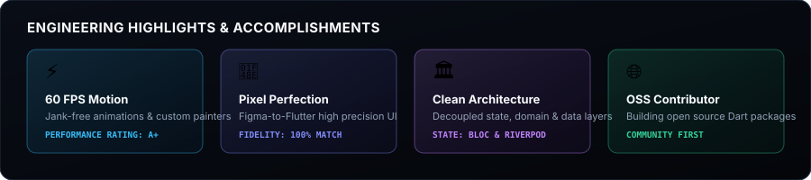

    

  <!-- Strategic Roadmap SVG Card -->
  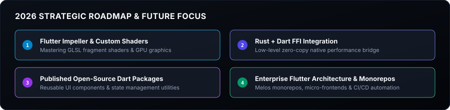

 

 

<!-- ========================================== -->
<!-- 09. SPOTIFY & VISITOR STATS -->
<!-- ========================================== -->

  <table>
    <tr>
      <td width="60%" align="center" valign="middle">
        <h4>🎧 Coding Soundtrack &amp; Focus Flow</h4>
        
      </td>
      <td width="40%" align="center" valign="middle">
        <h4>👁️ Profile Visitors</h4>
         
        
      </td>
    </tr>
  </table>

 

 

<!-- ========================================== -->
<!-- 10. CONTACT & FOOTER -->
<!-- ========================================== -->

  
  
    

  

    Open for high-impact <strong>Flutter</strong> mobile app development, cross-platform architecture, or open-source collaborations.
  

  

    
    &nbsp;&nbsp;
    
    &nbsp;&nbsp;
    
    &nbsp;&nbsp;
    
  

    

  <!-- Footer Banner SVG -->
  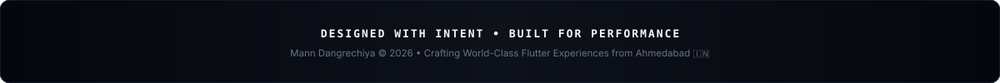

    

  <!-- Documentation Nav Bar -->
  
    <a href="INSTALL.md"><strong>INSTALLATION GUIDE</strong></a> &bull;
    <a href="CUSTOMIZATION.md"><strong>CUSTOMIZATION GUIDE</strong></a> &bull;
    <a href="DEPLOYMENT.md"><strong>DEPLOYMENT &amp; ACTIONS</strong></a> &bull;
    <a href="CHANGELOG.md"><strong>CHANGELOG</strong></a> &bull;
    <a href="LICENSE"><strong>LICENSE (MIT)</strong></a>
  

