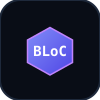

  <!-- Hero Banner SVG -->
  

    

  <!-- Dynamic Typing Header SVG -->
  

    

  <!-- Quick Social Navigation Badges -->
  
  &nbsp;&nbsp;
  
  &nbsp;&nbsp;
  
  &nbsp;&nbsp;
  

 

 

<!-- ========================================== -->
<!-- 01. ABOUT ME & WHOAMI.DART -->
<!-- ========================================== -->

  

 

<table>
  <tr>
    <td width="60%" valign="top">
      <h3>🚀 Senior Mobile Experience Engineer</h3>
      

        Welcome! I am <strong>Mann Dangrechiya</strong>, a dedicated Mobile Experience Engineer based in 
        <strong>Ahmedabad, Gujarat, India 🇮🇳</strong>.
      

      

        I specialize in engineering high-performance, cross-platform applications using 
        <a href="https://flutter.dev"><strong>Flutter</strong></a> and <a href="https://dart.dev"><strong>Dart</strong></a>. 
        My design and engineering philosophy is inspired by the extreme visual polish and developer experience of 
        <em>Linear</em>, <em>Vercel</em>, <em>Apple</em>, and <em>Raycast</em>.
      

       
      <h4>🎯 Primary Objective</h4>
      

        <strong>Become one of the world's best Flutter Engineers and Open Source contributors</strong> — pushing the boundary of mobile UI performance, 60 FPS animations, custom GLSL shaders, clean architecture, and reactive state management.
      

    </td>
    <td width="40%" valign="top" align="center">
      
    </td>
  </tr>
</table>

 

 

<!-- ========================================== -->
<!-- 02. SPECIALIZATIONS & TECH STACK -->
<!-- ========================================== -->

  

 

  <table>
    <tr>
      <td align="center" width="16%">
         
        <strong>Flutter</strong> 
        Cross-Platform
      </td>
      <td align="center" width="16%">
         
        <strong>Dart</strong> 
        OOP &amp; Functional
      </td>
      <td align="center" width="16%">
         
        <strong>Firebase</strong> 
        Cloud &amp; Auth
      </td>
      <td align="center" width="16%">
         
        <strong>BLoC / Cubit</strong> 
        State Flow
      </td>
      <td align="center" width="16%">
         
        <strong>Riverpod</strong> 
        Reactive State
      </td>
      <td align="center" width="16%">
         
        <strong>REST APIs</strong> 
        Dio &amp; Http
      </td>
    </tr>
    <tr>
      <td align="center" width="16%">
         
        <strong>Android</strong> 
        Kotlin / Gradle
      </td>
      <td align="center" width="16%">
         
        <strong>iOS</strong> 
        Swift / Xcode
      </td>
      <td align="center" width="16%">
         
        <strong>Git &amp; GitHub</strong> 
        Version Control
      </td>
      <td align="center" width="16%">
         
        <strong>Figma</strong> 
        UI/UX Design
      </td>
      <td align="center" width="16%">
         
        <strong>Docker</strong> 
        Containerization
      </td>
      <td align="center" width="16%">
         
        <strong>VS Code</strong> 
        IDE Tooling
      </td>
    </tr>
  </table>

 

 

<!-- ========================================== -->
<!-- 03. MOBILE ARCHITECTURE & SYSTEM DESIGN -->
<!-- ========================================== -->

  
  
    
  
  

 

 

<!-- ========================================== -->
<!-- 04. FEATURED PROJECTS -->
<!-- ========================================== -->

  

 

<table>
  <tr>
    <td width="50%" valign="top">
      <h3>📱 Echo Music Desktop</h3>
      

        A sleek, high-performance Flutter desktop music experience with smooth audio visualizers, reactive state management, offline caching, and cross-platform native audio controls.
      

      

        <code>Flutter</code> • <code>Dart</code> • <code>BLoC</code> • <code>Audio Service</code>
      

    </td>
    <td width="50%" valign="top">
      <h3>📊 AI Resume Customiser App</h3>
      

        An intelligent mobile application featuring automated CV analysis, tailored keyword extraction, instant PDF generation, and custom Flutter micro-animations.
      

      

        <code>Flutter</code> • <code>Firebase</code> • <code>REST API</code> • <code>Riverpod</code>
      

    </td>
  </tr>
  <tr>
    <td width="50%" valign="top">
      <h3>🩸 DBlood - Healthcare Network</h3>
      

        A real-time emergency blood donation network app connecting donors with local hospitals using geolocation, push notifications, and Firestore live data sync.
      

      

        <code>Flutter</code> • <code>Firebase Firestore</code> • <code>Geolocator</code>
      

    </td>
    <td width="50%" valign="top">
      <h3>🛒 Multi-Merchant POS System</h3>
      

        Enterprise-grade point-of-sale solution engineered with clean architecture, offline-first SQLite sync, thermal receipt printing, and real-time inventory metrics.
      

      

        <code>Flutter</code> • <code>Clean Arch</code> • <code>SQLite / Isar</code>
      

    </td>
  </tr>
</table>

 

 

<!-- ========================================== -->
<!-- 05. EXPERIENCE & TIMELINE -->
<!-- ========================================== -->

  
  
    
  
  

 

 

<!-- ========================================== -->
<!-- 06. GITHUB ANALYTICS & ACTIVITY -->
<!-- ========================================== -->

  
  
    

  <!-- Stats Grid -->
  
  &nbsp;
  

    

  <!-- GitHub Streak -->
  

    

  <!-- Contribution Snake Animation -->
  <h4>🐍 Contribution Matrix Activity</h4>
  

 

 

<!-- ========================================== -->
<!-- 07. ACHIEVEMENTS & ROADMAP -->
<!-- ========================================== -->

  
  
    

  <!-- Achievements SVG Card -->
  

    

  <!-- Strategic Roadmap SVG Card -->
  

 

 

<!-- ========================================== -->
<!-- 08. SPOTIFY & VISITOR STATS -->
<!-- ========================================== -->

  <table>
    <tr>
      <td width="60%" align="center" valign="middle">
        <h4>🎧 Coding Soundtrack &amp; Focus Flow</h4>
        <!-- Spotify Now Playing Card Embed -->
        
      </td>
      <td width="40%" align="center" valign="middle">
        <h4>👁️ Profile Visitors</h4>
         
        
      </td>
    </tr>
  </table>

 

 

<!-- ========================================== -->
<!-- 09. CONTACT & FOOTER -->
<!-- ========================================== -->

  
  
    

  

    Interested in collaborating on high-impact <strong>Flutter</strong> mobile apps, open-source projects, or architecture design?
  

  

    
    &nbsp;&nbsp;
    
  

    

  <!-- Footer Banner SVG -->
  

    

  <!-- Documentation Nav Bar -->
  
    <a href="INSTALL.md"><strong>INSTALLATION GUIDE</strong></a> &bull;
    <a href="CUSTOMIZATION.md"><strong>CUSTOMIZATION GUIDE</strong></a> &bull;
    <a href="DEPLOYMENT.md"><strong>DEPLOYMENT &amp; ACTIONS</strong></a> &bull;
    <a href="CHANGELOG.md"><strong>CHANGELOG</strong></a> &bull;
    <a href="LICENSE"><strong>LICENSE (MIT)</strong></a>
  

