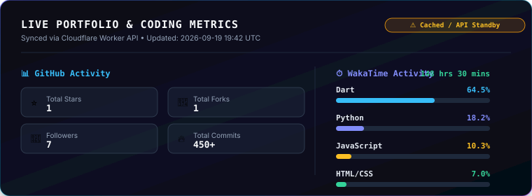

  <!-- SECTION 1: HERO HEADER & QUICK CONTACT PILLS -->
  

    

  
  &nbsp;&nbsp;
  
  &nbsp;&nbsp;
  
  &nbsp;&nbsp;
  

 

 

<!-- ========================================== -->
<!-- SECTION 2: EXECUTIVE SUMMARY & CORE SPECIALIZATION -->
<!-- ========================================== -->

  

 

<table>
  <tr>
    <td width="60%" valign="top">
      <h3>🚀 Senior Mobile Software Engineer &amp; Flutter Specialist</h3>
      

        I am <strong>Mann Dangrechiya</strong>, a results-driven Mobile Software Engineer based in 
        <strong>Ahmedabad, Gujarat, India 🇮🇳</strong> specializing in cross-platform mobile architecture for iOS &amp; Android.
      

      

        Currently working as a <strong>Flutter Developer at PrintDeed</strong> (Gandhinagar, Gujarat), building high-performance, production-grade applications. I hold a Bachelor's degree in <strong>Computer Engineering</strong> from LDRP Institute of Technology and Research (CGPA 7.76/10).
      

      

        <strong>Core Engineering Focus:</strong>
      

      <ul>
        <li><strong>Cross-Platform Development:</strong> High-performance 60 FPS mobile experiences built with Flutter &amp; Dart.</li>
        <li><strong>Architectural Discipline:</strong> Clean Architecture (Presentation, Domain, Data layers), Dependency Injection, &amp; Repository Pattern.</li>
        <li><strong>State Management:</strong> Production expertise in <code>Riverpod</code>, <code>Bloc</code>, <code>Provider</code>, and <code>GetX</code>.</li>
        <li><strong>Cloud &amp; Backend Integration:</strong> Firebase Services (Auth, Firestore, Cloud Functions), RESTful API design, &amp; offline data persistence.</li>
      </ul>
    </td>
    <td width="40%" valign="top" align="center">
      
    </td>
  </tr>
</table>

 

 

<!-- ========================================== -->
<!-- SECTION 3: TECHNICAL SKILLS MATRIX -->
<!-- ========================================== -->

  

 

<table>
  <tr>
    <th width="25%" align="left">Category</th>
    <th width="75%" align="left">Technologies &amp; Tools</th>
  </tr>
  <tr>
    <td><strong>📱 Frameworks &amp; Mobile</strong></td>
    <td>
      <code>Flutter</code> • <code>Dart</code> • <code>Flame Engine</code> • <code>Rive 3D</code> • <code>Android Native (Kotlin)</code> • <code>iOS (Swift)</code>
    </td>
  </tr>
  <tr>
    <td><strong>⚙️ State Management &amp; Architecture</strong></td>
    <td>
      <code>Clean Architecture</code> • <code>Riverpod</code> • <code>Bloc / Cubit</code> • <code>Provider</code> • <code>GetX</code> • <code>Repository Pattern</code>
    </td>
  </tr>
  <tr>
    <td><strong>☁️ Cloud &amp; Backend</strong></td>
    <td>
      <code>Firebase Auth</code> • <code>Cloud Firestore</code> • <code>Firebase Cloud Messaging</code> • <code>REST APIs</code> • <code>Cloudflare Workers</code>
    </td>
  </tr>
  <tr>
    <td><strong>🛠 Tools &amp; DevOps</strong></td>
    <td>
      <code>Git &amp; GitHub Actions</code> • <code>VS Code</code> • <code>Xcode</code> • <code>Android Studio</code> • <code>Figma to Code</code> • <code>Postman</code>
    </td>
  </tr>
</table>

 

 

<!-- ========================================== -->
<!-- SECTION 4: ARCHITECTURE & FEATURED MOBILE PROJECTS -->
<!-- ========================================== -->

  
  
    
  
  

 

  

 

<table>
  <tr>
    <td width="50%" valign="top">
      <h3>💇 Salon Booking App</h3>
      

        Production-grade mobile application for booking salon appointments with real-time slot availability, user authentication, service browsing, and booking status management.
      

      

        <strong>Tech Stack:</strong> <code>Flutter</code> • <code>Firebase</code> • <code>REST APIs</code> • <code>GetX</code>
      

      

        <a href="https://github.com/MannDangrechiya/salon_booking"><strong>🔗 View Repository on GitHub &rarr;</strong></a>
      

    </td>
    <td width="50%" valign="top">
      <h3>🍎 Fruit POS System</h3>
      

        Point of Sale (POS) application tailored for fruit vendors to manage inventory, bill calculations, real-time sales reporting, and offline-first transaction logging.
      

      

        <strong>Tech Stack:</strong> <code>Flutter</code> • <code>Cloud Firestore</code> • <code>Offline Sync</code> • <code>Riverpod</code>
      

      

        <a href="https://github.com/MannDangrechiya/fruit_pos"><strong>🔗 View Repository on GitHub &rarr;</strong></a>
      

    </td>
  </tr>
  <tr>
    <td width="50%" valign="top">
      <h3>🧮 Universal Calculator</h3>
      

        Feature-rich multi-functional calculator app supporting basic arithmetic, scientific evaluation, memory history, and responsive high-contrast dark theme styling.
      

      

        <strong>Tech Stack:</strong> <code>Flutter</code> • <code>Dart</code> • <code>Responsive UI</code>
      

      

        <a href="https://github.com/MannDangrechiya/universal_calculator"><strong>🔗 View Repository on GitHub &rarr;</strong></a>
      

    </td>
    <td width="50%" valign="top">
      <h3>🎮 3D Cyber Runner (Flutter Flame)</h3>
      

        Cross-platform 3D endless runner game showcasing Flame Engine integration, Rive 3D dynamic character animations, custom GLSL shaders, and real-time leaderboards.
      

      

        <strong>Tech Stack:</strong> <code>Flutter</code> • <code>Flame Engine</code> • <code>Rive 3D</code> • <code>GLSL Shaders</code>
      

      

        <a href="https://github.com/MannDangrechiya/flutter_3d_runner"><strong>🔗 View Repository on GitHub &rarr;</strong></a>
      

    </td>
  </tr>
</table>

 

 

<!-- ========================================== -->
<!-- SECTION 5: GITHUB ENGINEERING ACTIVITY & ANALYTICS -->
<!-- ========================================== -->

  
  
    

  <!-- Live Cloudflare API Stats SVG Card -->
  

    

  <!-- GitHub Stats & Top Languages -->
  
  &nbsp;
  

    

  <!-- Latest GitHub Activity Feed -->
  <h4>📡 Live Engineering Activity Feed</h4>

<!-- START_SECTION:activity -->

| Activity | Repository | Details | Timestamp |
| :--- | :--- | :--- | :--- |
| 🚀 Push | [MannDangrechiya/MannDangrechiya](https://github.com/MannDangrechiya/MannDangrechiya) | `Pushed commits` | `Aug 12, 2026 17:22 UTC` |
| 🚀 Push | [MannDangrechiya/MannDangrechiya](https://github.com/MannDangrechiya/MannDangrechiya) | `Pushed commits` | `Aug 12, 2026 17:20 UTC` |
| 🚀 Push | [MannDangrechiya/MannDangrechiya](https://github.com/MannDangrechiya/MannDangrechiya) | `Pushed commits` | `Aug 12, 2026 17:12 UTC` |
| 🚀 Push | [MannDangrechiya/MannDangrechiya](https://github.com/MannDangrechiya/MannDangrechiya) | `Pushed commits` | `Aug 12, 2026 17:10 UTC` |
| 🚀 Push | [MannDangrechiya/CineVault](https://github.com/MannDangrechiya/CineVault) | `Pushed commits` | `Aug 10, 2026 16:29 UTC` |

<!-- END_SECTION:activity -->

 

 

<!-- FOOTER & DIRECT CONTACT -->

  
  
    

  

    Open for senior-level <strong>Flutter / Mobile Application Engineering</strong> opportunities, cross-platform architecture, and high-impact technical collaborations.
  

  

    
    &nbsp;&nbsp;
    
    &nbsp;&nbsp;
    
  

    

  

    

  
    <a href="PROFILE_CHANGELOG.md"><strong>PROFILE CHANGELOG</strong></a> &bull;
    <a href="INSTALL.md"><strong>INSTALLATION GUIDE</strong></a> &bull;
    <a href="CUSTOMIZATION.md"><strong>CUSTOMIZATION GUIDE</strong></a> &bull;
    <a href="DEPLOYMENT.md"><strong>DEPLOYMENT</strong></a> &bull;
    <a href="LICENSE"><strong>LICENSE (MIT)</strong></a>
  

